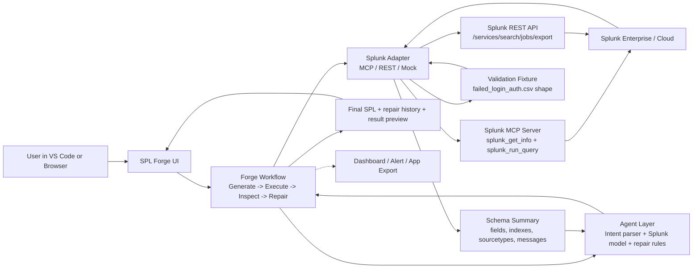

<div align="center">

# SPL Forge

## AI-native agentic IDE for Splunk

**AI-native Splunk development workspace for turning natural language into validated SPL, dashboards, alerts, and app-ready artifacts.**

[](#)
[](#)
[](#)
[](#)

</div>

## Overview

SPL Forge is a working VS Code extension for self-debugging Splunk development. It helps developers, security teams, and operations engineers describe an outcome in natural language and get back validated SPL plus app-ready Splunk artifacts.

Core workflow:

```text
Intent -> Generate SPL -> Execute -> Inspect -> Repair -> Preview -> Export
```

Instead of stopping at query suggestions, SPL Forge is intended to validate its own output against Splunk environment, repair common failures, and package final result into usable assets such as dashboards, alerts, and app packages.

## Why SPL Forge

Building useful Splunk content still requires too much manual effort:

- Users know question they want answered, but not always exact SPL.
- Query failures often come from missing fields, incorrect sourcetypes, or environment-specific schema differences.
- Turning working query into dashboard, alert, or packaged app is still separate workflow.
- Generic AI copilots can suggest SPL, but they do not reliably test and correct it against live Splunk data.

SPL Forge addresses that gap with agentic, execution-aware development loop built for real Splunk workflows.

## What Project Aims to Deliver

- Natural language to SPL generation for Splunk searches and detections
- Self-debugging query loop using execution feedback and schema introspection
- Support for Splunk-aware context such as indexes, sourcetypes, and fields
- Export flows for dashboards, alerts, reports, and lightweight app packaging
- Human-in-the-loop approvals before execution and export
- Real Splunk runtime support through MCP or REST execution
- Local Splunk Enterprise development environment for rapid iteration

## Product Direction

According to PRD, SPL Forge is being designed as:

- VS Code extension with optional companion web experience
- Practical agentic IDE for Splunk developers and analysts
- Focused initial workflow for validated search, dashboard, alert, and app export
- Foundation for broader AI-native Splunk development operations
- Self-hosted local development path aligned with Splunk free trial and Developer License flow

Initial walkthrough scenario is centered on failed-login monitoring, where system generates query, detects a live runtime or schema issue, repairs it with schema context, previews results, and exports dashboard and alert package.

## Intended Users

- Splunk app developers who want to move from idea to artifact faster
- Security analysts creating detection searches and dashboards
- SRE and DevOps teams building operational monitoring views under time pressure
- Splunk admins and platform engineers supporting repeatable content creation
- Development teams who need repeatable local Splunk validation during build and walkthrough work

## Architecture Snapshot

| Layer | Planned Approach |
| --- | --- |
| IDE | VS Code extension |
| Language | TypeScript and Node.js |
| UI | VS Code webview panel plus standalone browser dashboard |
| Validation | Structured schema and artifact validation |
| Splunk connectivity | Splunk MCP Server or Splunk REST API |
| Local Splunk | Self-hosted Splunk Enterprise free trial with Developer License |
| AI layer | Splunk MCP AI Assistant tool or Splunk-hosted model endpoint |
| Export | Dashboard, alert, saved search, props.conf, metadata, and app-ready folder generation |

Full architecture reference: [`architecture_diagram.md`](./architecture_diagram.md).



## Run End To End

Use this path to evaluate SPL Forge from a fresh clone through generated SPL, Splunk execution, repair, artifact preview, export, and publish.

### 1. Clone And Install

```bash
git clone https://github.com/Utpal-Kalita/SPL-Forge SPL-Forge
cd SPL-Forge
npm install
```

### 2. Prepare Splunk

Install Splunk Enterprise locally, apply a Developer License, and load the sample auth data.

Setup docs:

- [`docs/FREE_TRIAL_SETUP.md`](./docs/FREE_TRIAL_SETUP.md)
- [`docs/SPLUNK_SETUP.md`](./docs/SPLUNK_SETUP.md)
- [`docs/SAMPLE_DATA.md`](./docs/SAMPLE_DATA.md)

Expected local data:

```text
index=main sourcetype=auth
index=main sourcetype=auth_complex
```

Quick Splunk checks:

```spl
index=main sourcetype=auth | head 10
```

```spl
index=main sourcetype=auth action=failure | stats count by country
```

### 3. Configure SPL Forge

Create local config:

```bash
cp .env.example .env.local
```

For local REST mode:

```bash
SPL_FORGE_SPLUNK_MODE=rest
SPL_FORGE_SPLUNK_URL=https://localhost:8089
SPL_FORGE_SPLUNK_ALLOW_SELF_SIGNED=true
SPL_FORGE_SPLUNK_SOURCE=self_hosted_trial
SPL_FORGE_SPLUNK_USERNAME=admin
# Set SPL_FORGE_SPLUNK_PASSWORD in .env.local to your local Splunk password.
```

REST mode handles search execution and publish operations. SPL generation still needs one of the Splunk model paths below.

For MCP mode:

```bash
SPL_FORGE_SPLUNK_MODE=mcp
SPL_FORGE_SPLUNK_MCP_ENDPOINT=https://localhost:8089/services/mcp
# Set SPL_FORGE_SPLUNK_MCP_TOKEN in .env.local to the encrypted token from Splunk MCP Server.
SPL_FORGE_SPLUNK_MCP_ALLOW_SELF_SIGNED=true
SPL_FORGE_SPLUNK_SOURCE=self_hosted_trial
```

For Splunk-hosted model generation through MCP AI Assistant, set:

```bash
SPL_FORGE_LLM_PROVIDER=splunk
SPL_FORGE_LLM_MODEL=splunk-hosted-model
SPL_FORGE_SPLUNK_MODEL_TOOL=saia_generate_spl
```

For a direct Splunk-hosted model endpoint instead of MCP AI Assistant tooling, set:

```bash
SPL_FORGE_LLM_PROVIDER=splunk
SPL_FORGE_LLM_MODEL=splunk-hosted-model
# Set SPL_FORGE_SPLUNK_MODEL_ENDPOINT in .env.local to the direct model endpoint.
# Set SPL_FORGE_SPLUNK_MODEL_TOKEN in .env.local to the Splunk token for that endpoint.
```

Never commit `.env.local`.

### 4. Run The Browser Dashboard

This is the fastest way to see the full workflow outside VS Code:

```bash
npm run dashboard -- --mode rest
```

or:

```bash
npm run dashboard -- --mode mcp
```

Open the printed local URL and use this prompt:

```text
Create a failed login dashboard by country and user agent for the last 30 minutes. Alert if failed attempts exceed 100 in 5 minutes.
```

Expected result:

```text
Prompt -> Generate SPL -> Run in Splunk -> Inspect/Repair -> Preview dashboard and alert -> Export app
```

### 5. Run The VS Code Extension

```bash
npm run watch
```

Then:

1. Open the repo in VS Code.
2. Press `F5` to launch the Extension Development Host.
3. Run `SPL Forge: Open Panel` from the Command Palette.
4. Paste the same failed-login prompt.
5. Click `Generate + Run SPL`.
6. Review final SPL, repair history, result preview, dashboard preview, and alert preview.

### 6. Verify The Live Flow

Run prompt verification against live Splunk:

```bash
npm run verify:prompts -- --mode rest --all --delay-ms 2500
```

or:

```bash
npm run verify:prompts -- --mode mcp --all --delay-ms 2500
```

Run release verification:

```bash
npm run verify:release
```

`verify:release` expects live Splunk model generation and live Splunk search execution. Use `mcp` or `rest`, not `mock`.

### 7. Export And Publish Artifacts

Export an app-ready folder:

```bash
npm run export:app -- --mode rest
```

or:

```bash
npm run export:app -- --mode mcp
```

Publish the generated dashboard and disabled alert to Splunk:

```bash
npm run publish:app -- --mode rest
```

or:

```bash
npm run publish:app -- --mode mcp
```

Open Splunk Web:

```text
http://localhost:8000/app/search/failed_login_dashboard
```

### 8. Offline Smoke Path

Use mock mode only when Splunk is unavailable:

```bash
npm run dashboard -- --mode mock
```

Mock mode is useful for UI review, but it is not a live Splunk validation path.

## Current Status

This repository contains a working product implementation. It includes a VS Code panel, a standalone browser dashboard, a working Splunk-hosted-model path, and a partial app deployment path. Complete Splunk app install automation is still pending.

Current repository assets:

- Product requirements in [`PRD.md`](./PRD.md)
- Delivery roadmap in [`ROADMAP.md`](./ROADMAP.md)
- Setup guides for VS Code, Splunk, and first-run workflow
- Supporting docs for architecture, walkthrough flow, and contribution expectations
- Brand banner and repository presentation assets
- Simple and complex auth sample datasets in `samples/`
- VS Code extension shell with intent-aware SPL generation and query plan feedback
- MCP/REST Splunk execution path with result preview in the panel
- Self-debugging loop that inspects schema after failed or empty execution, repairs common SPL mistakes, and reruns with capped attempts
- Dashboard Studio JSON preview generated from final working SPL for dashboard prompts
- Classic XML dashboard publish path via `npm run publish:dashboard` for Splunk UI verification
- Dashboard plus disabled alert publish path via `npm run publish:app` or the panel Publish to Splunk button
- Alert saved-search preview generated from threshold prompts
- Minimal Splunk app folder export via `npm run export:app`
- Generated app includes `props.conf` CSV field extraction stanzas for `auth` and `auth_complex` walkthrough sourcetypes
- Publish flow reloads dashboard and saved-search REST endpoints after create/update
- Working Splunk model provider path through configurable MCP AI Assistant tool (`SPL_FORGE_SPLUNK_MODEL_TOOL`) or direct Splunk-hosted model endpoint
- Standalone browser dashboard via `npm run dashboard -- --mode mcp` or `npm run dashboard -- --mode rest`
- Sixteen-prompt smoke verifier via `npm run verify:prompts -- --mode mcp --all --delay-ms 2500`
- Release verifier via `npm run verify:release`
- Polished VS Code panel flow with query history, error log, Run, Export App, and Publish to Splunk controls
- Stability coverage for trend breakdowns, successful-login prompts, source-IP grouping, threshold alerts, unsafe provider output, and complex `auth_complex` risk/MFA/privileged/service-account prompts
- Root architecture diagram and MIT license for release readiness

## Reality Check

- Splunk Hosted Models: implemented as configurable Splunk MCP AI Assistant tool or direct Splunk model endpoint. Release verification is intended to use one of these live Splunk paths, not a third-party or mock model.
- Standalone web dashboard: implemented as local browser dashboard served by `npm run dashboard`.
- Complete app deployment: partial. SPL Forge exports an app folder and publishes dashboard plus disabled alert through REST with endpoint reloads. Full app install/reload automation is not claimed.
- True multi-agent architecture: not implemented. Current runtime is one workflow loop with generation, execution, schema inspection, repair, artifact export, and publish stages.

## Release Check

Before publishing or recording a walkthrough, run:

```bash
npm run verify:release
```

This command checks:

- root `LICENSE`
- root `architecture_diagram.md`
- commit history on or after 2026-05-18
- remote Git reachability
- live Splunk model generation
- live Splunk search execution in `mcp` or `rest` mode

## Documentation

- [Docs Index](./docs/README.md)
- [Product Requirements Document](./PRD.md)
- [Roadmap](./ROADMAP.md)
- [Progress](./docs/PROGRESS.md)
- [Quickstart](./docs/QUICKSTART.md)
- [VS Code Setup](./docs/VS_CODE_SETUP.md)
- [Sample Data](./docs/SAMPLE_DATA.md)
- [Splunk Setup](./docs/SPLUNK_SETUP.md)
- [Splunk MCP Server Research](./docs/SPLUNK_MCP.md)
- [Free Trial Setup](./docs/FREE_TRIAL_SETUP.md)
- [Architecture](./docs/ARCHITECTURE.md)
- [Walkthrough Runbook](./docs/WALKTHROUGH_RUNBOOK.md)

## Vision

SPL Forge is built around one clear idea: Splunk development should feel more like describing intent and less like manually stitching together query syntax, dashboard configs, and packaging steps. For local product work, the repository assumes a self-hosted Splunk Enterprise free trial upgraded with a Developer License.

Long-term opportunity is AI-native development layer for Splunk that can help teams generate, verify, explain, and operationalize Splunk content with less friction and more trust.

---

<div align="center">

**SPL Forge**  
From natural-language intent to validated Splunk artifacts, with Splunk-native local development.

</div>
