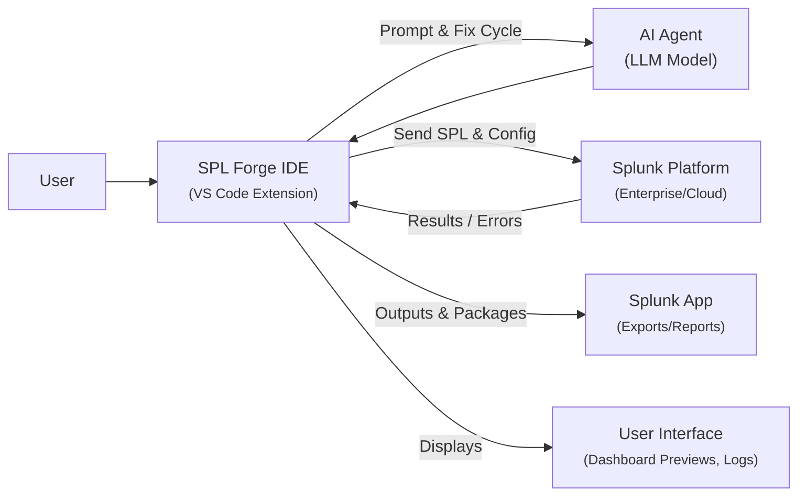

# SPL Forge: Self-Debugging Agentic IDE for Splunk – Roadmap

## Executive Summary  
**SPL Forge** is an AI-powered integrated development environment that transforms natural-language requirements into working Splunk searches, dashboards, alerts, and apps. It extends Splunk’s VS Code extension with an LLM-based agent that *writes, tests, debugs,* and *packages* Splunk artifacts end-to-end. This roadmap outlines a phased plan: a 10-day MVP to demonstrate core capabilities, followed by expansion into a full product that leverages Splunk’s new AI platform (MCP Server, AI Assistant, hosted models) and modern LLMs. The goal is to dramatically accelerate Splunk development: automate repetitive SPL coding and debugging tasks, improve developer productivity, and reduce errors. In the **Vision** and **Why Now** sections we highlight market timing – Splunk itself calls 2026 “the year of the Agentic AI Revolution”【21†L7-L15】 and now provides tools (MCP, hosted models, AI Assistant) to enable this vision. The roadmap then details the MVP build (with daily milestones), post-MVP features, community and ecosystem plans, monetization strategy, and demo plan. Quantitative and qualitative success metrics are defined to measure adoption (e.g. user growth, productivity gains) and impact (error reduction, developer satisfaction). This plan is designed to be persuasive to investors (clear phases, ROI paths, tech stack) and understandable to Splunk users and developers.

## Vision  
SPL Forge is an **AI-native Splunk developer IDE** that turns English-language instructions into deployable Splunk solutions. In practice, a user describes a need (e.g. “Show failed login attempts by country in the last hour, and alert if above 50”), and SPL Forge generates the SPL query, executes it against live data, iteratively fixes any errors, and builds a dashboard and alert. It then packages these assets into a Splunk app or saves them. The vision is to make Splunk app development **as easy as a conversation**.  

This goes beyond existing tools. For example, the official Splunk VS Code extension “helps developers create, test, and debug Splunk Enterprise apps, add-ons, custom commands…”【24†L46-L54】. SPL Forge layers on AI so that developers *don’t have to hand-write* the code in the first place. It effectively becomes an AI “pair-programmer” or co-pilot for Splunk, similar to how code assistants (e.g. Copilot) are described as “AI-driven tools embedded in development environments that help developers write, autocomplete, and understand code”【19†L328-L334】. Unlike a simple autocomplete, SPL Forge completes the entire development *loop*: generate code, run it, catch errors, and refine – all autonomously, yet with human oversight.  

**Target users** include Splunk app developers, SRE/DevOps engineers, security analysts and platform teams. For example, a security analyst could describe a detection rule (“alert on anomalous port scans”) and get a working Spl query and dashboard; an SRE could quickly generate an infrastructure monitoring dashboard; or a Splunk app developer could have SPL Forge write and package a new report. By automating routine SPL coding and debugging, SPL Forge frees experts to focus on strategy and analysis. In short, it’s “an AI-native command center” for Splunk developers【21†L13-L21】【19†L232-L241】.  

## Problem  
Today, **Splunk development is laborious and error-prone**. Developers and analysts must manually write SPL queries (a domain-specific search language), configure dashboards (in XML/JSON or with GUI editors), create alerts/reports, and package everything as a Splunk app. Each step is fiddly: naming fields correctly, handling index/time nuances, debugging SPL syntax, and understanding Splunk’s REST API or SDK to deploy artifacts. Onboarding is slow because of the steep learning curve. A single typo or unknown field can cause silent failures. As Splunk’s community notes, there is still much “friction” in the builder experience and opportunity to make workflows “more intuitive”【30†L55-L63】.  

Repetitive tasks dominate: copy-pasting queries, repeatedly searching to test, hunting down obscure documentation for conf files. This drains productivity. Splunk’s own hackathon announcement acknowledges that AI should be used to “reduce friction for the teams creating and operating modern systems”【30†L55-L63】. At the same time, security and reliability teams face a deluge of data. They need fast answers, but building Splunk queries and dashboards is a bottleneck. As one blog puts it: “AI can help teams monitor systems smarter, detect issues faster, and unlock new ways to build”【28†L157-L164】 – but only if the AI tools can quickly be taught to interact with Splunk.  

Crucially, raw LLM code outputs are often imperfect. Research shows many autonomous coding agents produce code with subtle bugs, necessitating human review【14†L122-L131】. In Splunk’s context, this means a generated query might not run or might produce wrong results. Without automatic validation and correction, users cannot rely on such tools. Thus there is a clear need for an agentic IDE that not only *generates* Splunk code, but also *self-tests and debugs* it, closing the loop. This self-debugging capability is what differentiates SPL Forge from a basic chatbot or Copilot.  

## Why Now  
Several converging trends make this the right moment for SPL Forge:

- **Agentic AI Adoption:** The industry is rapidly moving into an “Agentic AI” era. Splunk itself declares 2026 “the year of the Agentic AI Revolution”【21†L7-L15】. Analysts predict roughly one-third of enterprise apps will include agentic AI by 2028【21†L28-L32】. Enterprises are investing in AI-powered automation to reduce manual toil. Splunk’s data-centric products (logs, metrics, etc.) are prime input for AI agents.

- **Splunk’s New Platform Capabilities:** Splunk is releasing tools specifically for AI integration. In early 2026 they made the **Model Context Protocol (MCP) Server** generally available【21†L55-L64】. MCP provides “a secure, standardized bridge between your intelligent agents and your Splunk data”【21†L57-L64】, solving the “Island Problem” where AI tools couldn’t easily query Splunk. Splunk is also launching hosted AI models (fine-tuned for log data) and the Splunk AI Assistant (an LLM-backed query builder). The Agentic Ops hackathon materials explicitly recommend using MCP and the AI Assistant: *“Splunk MCP server to connect AI agents securely to Splunk”* and *“Splunk AI Assistant to generate and edit SPL queries using natural language”*【30†L68-L74】. In short, the infrastructure and APIs needed to connect LLMs to Splunk now exist.

- **Mature LLM Technology:** Large language models (LLMs) have proven they can generate code snippets from prompts. Free or low-cost APIs (OpenAI GPT, Anthropic Claude, open-source LLaMA derivatives) are readily available. Checkmarx notes that modern AI dev tools “use large language models, embeddings, and automation agents to accelerate coding, testing, security, DevOps, and documentation workflows”【19†L232-L241】. These tools reduce repetitive work and help teams ship faster. Splunk Forge rides this trend by applying LLMs specifically to Splunk’s domain.

- **Market Opportunity:** Despite many “chatbot” copilots, few products target Splunk development end-to-end. Splunk’s hackathon encourages “Platform” category ideas that “make it easier to create, extend, and automate with Splunk”【30†L55-L63】. Investors and early adopters will value a solution that demonstrably speeds up Splunk deployment and reduces errors. 

In summary, Splunk’s own messaging and recent feature releases align perfectly with SPL Forge’s goals. The platform supports agentic use-cases, industry demand is high, and the technology to build it is here. 

## MVP Scope (10 Days) – Daily Milestones  
**Goal:** Deliver a working prototype in 10 days that can take a natural-language prompt, generate an SPL query, execute it on Splunk, iterate to fix errors, and output a simple dashboard or report.  

- **Day 1: Setup & Planning.** Set up development environment. Install Splunk Enterprise or Cloud dev instance and the official Splunk VS Code extension【24†L46-L54】. Scaffold a new VS Code extension (TypeScript/Node.js) for SPL Forge. Define architecture (see later). Prepare sample data in Splunk (e.g. web_logs index). *Deliverable:* Dev environment ready; architecture diagram draft.  

- **Day 2: LLM Integration.** Integrate an LLM API (e.g. OpenAI GPT or an open-source LLM) into the extension. Implement a simple chat/prompt function. Test with a placeholder: user types English, LLM returns a raw SPL string. *Deliverable:* Text input in VS Code panel passes through LLM; results logged.  

- **Day 3: Query Generation.** Build the prompt engineering: given user intent, generate a full Splunk query. Example: user input “failed login attempts by user in last 5 mins”, LLM should output valid SPL (e.g. `index=security sourcetype=auth action=failed | stats count by user`). *Deliverable:* Sample prompts yield reasonable SPL queries.  

- **Day 4: Splunk Connectivity (MCP/REST).** Connect the extension to Splunk. Use Splunk’s REST API or MCP to execute queries from VS Code. (Splunk docs note that IDEs like VS Code connect to MCP with tokens/headers【8†L610-L618】.) Configure credentials or token for Splunk access. Test by running a known saved search and displaying results in VS Code. *Deliverable:* Extension can send SPL to Splunk, retrieve results or errors.  

- **Day 5: Self-Debugging Loop.** Implement error detection and repair. After generating SPL, run it. If Splunk returns an error (e.g. unknown field), feed the error message back into the LLM with the query for correction. The LLM should produce a revised query. Repeat until successful (limit 2-3 attempts). *Deliverable:* Faulty generated query triggers LLM re-write (e.g. correcting field names), and a working query is obtained.  

- **Day 6: Dashboard Generation.** Extend the agent to produce a dashboard or visualization definition. Prompt the LLM to convert the final SPL query and result schema into a simple Dashboard Studio (XML/JSON) layout or a Splunk Dashboard. *Deliverable:* LLM outputs dashboard code (graph/table config). Load and view it in Splunk UI.  

- **Day 7: Packaging & Alerts.** Implement export of results. Automatically create a minimal Splunk app or saved search from the generated artifacts. For MVP, exporting as a zip or directory with a simple `app.conf`, queries, and dashboards is enough. Optionally handle alert creation (user prompt “alert on X”). *Deliverable:* A downloadable Splunk app folder or JSON that can be imported, containing the query, dashboard, and alert settings.  

- **Day 8: UI Enhancements.** Polish the VS Code UI. Add a panel or input field for prompts, display query history, show error logs. Provide buttons like “Run” and “Export App”. Ensure the UI flow is smooth. *Deliverable:* A basic but user-friendly extension panel for interaction.  
  - **Status:** Complete in current MVP panel with prompt input, query history, error log, Generate + Run SPL, Export App, and Publish to Splunk controls.

- **Day 9: Testing & Iteration.** Run multiple test scenarios (different prompts, complex queries). Identify bugs or edge cases. Improve prompt templates or error handling as needed. Ensure SPL Forge can handle at least 2-3 distinct use-cases. *Deliverable:* Stability fixes, improved reliability.  

- **Day 10: Demo Prep.** Prepare the hackathon demo script and sample data sets. Record or rehearse the 3-minute walkthrough (see below). Finalize architecture diagram and README. *Deliverable:* Demo video storyboard ready; final working prototype.  

Throughout the MVP, we focus on a **realistic scope**: for example, we can hard-code a few key SPL templates or result-field names for testing rather than solve every generic case. The outcome will be a convincing proof-of-concept that clearly shows SPL Forge generating, fixing, and visualizing Splunk content in real-time.  

**MVP Resources:** A small team (1–2 developers) equipped with a Splunk dev environment (Splunk Developer License is free) and an LLM access (API key or local model). Estimated costs are modest (see Tech Stack), since Splunk tools and VS Code are free and small cloud compute can host Splunk for $20–$50/month. 

## Post-MVP Expansion (Phases)  
After the 10-day MVP, we enter an iterative expansion phase. Key activities include: improved UI/UX, support for more Splunk features (SPL2, data sources, multi-step workflows), integration with version control, and performance optimizations. We also begin engaging early users and building community momentum. Below is a high-level phased plan:

| Phase | Timeframe | Key Deliverables | Resources (approx) | 
|---|---|---|---|
| **Phase 1: MVP (Core Prototype)** | 10 days | Functional prototype: VS Code extension that can interpret NL prompts into Splunk queries, run them via API/MCP, auto-fix errors, and generate a basic dashboard/app. Initial demo scenarios (2-3 cases). | 1–2 engineers, Splunk dev instance (free license), LLM API access |
| **Phase 2: Beta (Feature Expansion)** | 1–3 months | Feature-rich beta: multi-turn conversation support; advanced prompt templates; support for SPL2 and saved searches; richer UI (syntax highlighting, logs); multi-platform (VS Code + simple web UI); integration with Splunk DevOps (CI/CD pipelines); initial security/testing (e.g. linting of generated SPL). Onboard 10–20 beta users; gather feedback. | 2–3 devs (adding UI/UX), product manager/tester, cloud for hosting extension backend if needed |
| **Phase 3: Public Release & Growth** | 6–12 months | Official release: polished product (or Splunk App) with documentation, tutorials, and support. Integration with Splunkbase and marketing. Community forums and plugins (e.g. GitHub repo, examples). Possible plugins for IDEs beyond VS Code. Early monetization models (see below). Goal: 500+ users/orgs, positive NPS. | 3–5 devs, 1 community/marketing lead, partnerships (e.g. Splunk incubation program) |
| **Phase 4: Long-term Ecosystem** | 12–24 months+ | Mature platform: extensible APIs for custom agents; support for multi-cloud Splunk; enterprise features (SSO, audit logging); marketplace of pre-built “intents” or query templates; partnerships (e.g. Splunk OEM). 10k+ orgs adoption. Continual innovation with emerging AI/ML (see Future). | Full team (5–10 engineers, product, marketing), possible venture or Splunk backing, ongoing Ops/infra costs |

Each phase will be further broken into sprints/tasks. We will continuously measure user impact (time saved, satisfaction) to guide priority. The MVP table above ensures the first 10 days are laser-focused on a working demo; subsequent phases are progressively less restrictive in timeline but also involve more users and complexity. 

## AI & Automation Possibilities  
In the expansion phase and beyond, SPL Forge can leverage many advanced AI techniques:

- **Multi-Agent Workflows:** Employ multiple specialized agents. For example, one agent crafts the initial SPL, another reviews or optimizes it (like an AI code review), and a third writes documentation or test cases. This follows the “Agentic Loop” concept where agents iteratively refine output【14†L122-L131】. We can even integrate user-in-the-loop “merge readiness” packs if needed, letting human analysts quickly vet large changes.

- **Rich Conversational UI:** Move from single-prompt interactions to a chat-like interface. Users could refine a query by asking follow-up questions (“What if I only want high-priority errors?”) and SPL Forge could adjust the SPL dynamically. The Splunk AI Assistant (chat-based in Splunk UI) provides inspiration here【28†L157-L164】.

- **Semantic Understanding & RAG:** Incorporate Splunk’s machine data lake or index metadata. For example, use retrieval-augmented generation (RAG) so the LLM knows the actual field names, indexes, and data schema. The extension could fetch Splunk’s field lists or data samples and feed them into the prompt, improving accuracy.

- **Automated Testing & Security:** Add automated validation of generated searches. We could integrate security and style checkers (similar to the **One Assist** security agent mentioned by Checkmarx【19†L275-L283】) to flag bad practices or vulnerabilities (e.g. overly broad searches). Tests could be auto-generated: after query creation, SPL Forge could spin up simulated data to verify correctness.

- **Git/CI Integration:** Connect with version control. SPL Forge could commit generated dashboards or queries to a Git repo, or trigger CI pipelines to run them nightly. For example, pushing an “SPL Forge app” could auto-launch a build/test of that app.

- **Voice/Chat Interfaces:** Future work could allow voice commands (via speech-to-text) to describe queries, or integration into Slack/Teams as a bot (“/splforge show me X”).

- **Cross-Domain Automation:** With Splunk often part of larger workflows, SPL Forge could automate cross-tool workflows. E.g., after creating a dashboard, it might automatically open a Jira ticket for an on-call team or update a Confluence page.

- **Pluggable Models:** Offer options beyond a single LLM. In-house embedding of smaller LLMs or domain-specific models (like the Splunk-hosted Foundation Security model【21†L47-L53】) can reduce latency/cost and improve context. We might allow users to bring their own models or connect to cloud LLMs via MCP for extra flexibility.

These advanced features will require careful engineering, but all are realistic extensions of current AI/DevOps trends. As Checkmarx observes, modern AI dev tools are already automating “code generation, security scanning, testing, documentation, and debugging”【19†L247-L253】. SPL Forge can incorporate these capabilities over time to continuously raise the intelligence and autonomy of the IDE.  

## Community Growth  
Building a user and developer community will be key:

- **Open Source / Splunkbase Presence:** We will release SPL Forge (or parts of it) as an open-source project or Splunk App. This encourages contributions, feedback, and trust. A GitHub repo for the extension and a listing on Splunkbase ensures visibility to Splunk’s ecosystem.

- **Tutorials & Documentation:** Publish quickstart guides, code labs, and example prompts. Host webinars or workshops at community meetups/.conf (virtual or onsite). Splunk’s own learning paths now cover agentic AI; we can align with those.

- **Integration with Splunk Community:** Participate on Splunk Answers and Slack, address user questions. Possibly join Splunk Developer groups or sponsor a DevOps/AI meetup. 

- **Hackathons & Competitions:** Submit SPL Forge to contests (like this Agentic Ops hackathon) and encourage the community to build plugins or extensions using it.

- **Feedback Loops:** Establish a user forum or Discord. Early adopters will share use cases and pain points, guiding our roadmap. Positive reviews (e.g. on Splunkbase) will drive awareness.

A healthy community also aids product quality. Users might share custom “intents” or prompt templates (e.g., “create a security incident dashboard”), which we can curate into an “Example Gallery” within SPL Forge. Over time, the tool itself could leverage crowd-sourced knowledge (e.g. common queries) to improve suggestions. 

## Monetization  
Possible business models include:

- **Freemium/Commercial Add-on:** Offer SPL Forge as a free plugin for individual developers (with basic features), and a paid enterprise version with advanced capabilities (team collaboration features, usage analytics, support SLAs). Enterprise pricing could be per-seat or per-organization, similar to other Splunk add-ons.

- **Consulting & Professional Services:** Generate revenue by offering implementation services, custom model training (e.g. training an LLM on a customer’s logs), or priority support. Many Splunk partners offer professional services, and SPL Forge could be a bundled solution.

- **SaaS Platform:** Host SPL Forge as a cloud service (integrated with Splunk Cloud). Charge a subscription per org for cloud hosting, maintenance, and continuous upgrades. This model fits customers without on-prem infrastructure.

- **Marketplace & Partnerships:** Partner with Splunk as an official partner offering. Possibly revenue-sharing if bundled through Splunk. Or list on Splunkbase as a paid app. One could also explore usage-based pricing (e.g. per query generation, though customers may prefer flat fees).

Given the developer-centric nature, we might initially market SPL Forge as a value-add. For example, pitching to enterprise Splunk admins: “Boost your team’s productivity 5x and reduce error-induced downtime.” Showing quantifiable ROI (see metrics) will justify investment.  

## Long-Term Ecosystem  
Looking 2–5 years ahead, SPL Forge can evolve into a comprehensive **Agentic Ops platform** for Splunk and even broader monitoring/DevOps:

- **Platform Extensions:** SPL Forge could expose APIs or hooks so others can build plugins. For example, third-party plugins might add a security scanner plugin, or a pre-built “incident investigation” agent.

- **Cross-Tool Integration:** Expand beyond Splunk. In large orgs, analytics involve multiple systems (e.g. Kafka, cloud logs, APM tools). An advanced SPL Forge could orchestrate across tools, using Splunk as the core. LLM agents could also trigger actions in AWS, Kubernetes, etc.

- **Marketplace of AI Workflows:** Similar to Splunkbase, a marketplace where developers share complete “AI workflows” (e.g. “Network TroubleShooting Agent”, “Ransomware Detection Dashboard”) built with SPL Forge. This encourages reuse and ecosystem lock-in.

- **Enterprise Features:** Add governance – audit trails of what the agent did, approval workflows, role-based access for running certain commands. These features become important in a corporate deployment.

- **Research & AI Advances:** As AI progresses (e.g. multimodal models, on-device LLMs), we can integrate those. For instance, using computer vision to analyze existing dashboard screenshots and import them, or running LLM entirely locally for high security.

SPL Forge could become a nucleus of a new AI-enabled Splunk ecosystem, where data-driven operations are largely automated. Over time, this could lead to partnerships or acquisitions (e.g. by Splunk or a major SIEM vendor), but even as a standalone product it would transform how customers use Splunk.

## Technical Architecture  

*Figure: High-level architecture of SPL Forge.*  

**Explanation:** The user interacts via VS Code (the SPL Forge extension). A prompt is sent to an LLM agent (hosted via API or Splunk’s hosted model). The extension also queries Splunk’s REST/MCP API to run searches. Errors or results from Splunk are fed back into the LLM if needed, creating an agentic loop. Final outputs (SPL code, dashboards, alerts) are presented in the IDE and can be exported as a Splunk app. In practice, the extension is built in TypeScript/Node.js (leveraging VS Code’s API)【24†L46-L54】, the LLM interface can use a cloud API or local model, and communication with Splunk uses standard REST calls (the Splunk extension already “communicates with the Splunk REST API to enumerate saved searches and display reports”【24†L72-L80】) or the new MCP protocol for secure access【8†L610-L618】.  

**Tech Stack Recommendation:** 
- **Front-end/UI:** Visual Studio Code Extension (TypeScript/Node.js) with custom React or plain WebView panels for the UI. This allows in-editor rendering of prompts, logs, and query results.  
- **LLM Backend:** Initially integrate OpenAI’s GPT or Anthropic’s Claude via API (fast to MVP), or use open-source LLaMA/CodeLLaMA models locally (for cost saving). Optionally leverage Splunk’s hosted models via MCP.  
- **Splunk Access:** Splunk Enterprise (dev licence) or Splunk Cloud (trial) as the data source. Use Splunk’s REST API or the MCP server for running queries and retrieving fields. The Splunk Python SDK (for prototyping scripts) or Splunk’s REST endpoints (as used by the official extension) can be used.  
- **Infrastructure:** A modest server or cloud VM (2–4 vCPUs, 8–16GB RAM) to host Splunk and possibly a local LLM. Splunk itself can run on this (development mode). The extension mostly runs on the user’s machine.  
- **DevOps:** Git for version control; GitHub Actions or similar for CI (could run tests of generated queries).  
- **Cost Estimates (MVP):** Splunk Developer license is free. A small VM ($20–$50/month) covers Splunk and an LLM container. Using OpenAI for say 1000 queries/month might cost <$50. Thus initial infra cost could be <$100/month. Most cost is developer time.  

## Success Metrics  
To gauge success, we track both **quantitative** and **qualitative** metrics:

- **Usage & Adoption:** Number of active users/organizations deploying SPL Forge. For hackathon proof, success could be measured by, e.g., generating *n* dashboards without errors. Longer-term: reaching *x* downloads or *y* enterprise clients within 6–12 months.

- **Productivity Improvement:** Time saved per task. We can measure average time to build a Splunk dashboard/query with vs without SPL Forge (target: ≥50% reduction). Monitor metrics like *queries generated vs manually written*, or *average SPL lines per minute*.

- **Accuracy / Quality:** Rate of first-run success (percentage of generated queries that run without manual fixes). We aim to minimize the number of LLM iterations to fix code. Given research that many AI-generated PRs are not “merge-ready”【14†L122-L131】, a good success is if ≥70–80% of generated queries work after at most 1 iteration.

- **User Satisfaction:** Survey Net Promoter Score (NPS) among early testers. Qualitative feedback (ease of use, trustworthiness). We expect developers to report saving hours per week. 

- **Community Engagement:** Stars/forks on GitHub, forum posts, Splunkbase reviews, contributions. A thriving community indicates product-market fit. 

- **Operational Metrics:** Latency of query generation and execution (should be interactive), uptime (SLAs for enterprise), and resource usage (controlling API costs). 

Quantitatively, one could say: *by Day 10, the demo should generate at least 3 different Splunk dashboards*【24†L46-L54】【28†L157-L164】. Within 6 months, aim for 100+ engaged users and measurable time savings. These metrics will be updated based on customer feedback and priorities.

## Future Experimental Ideas  
Looking further ahead, we can explore visionary ideas to stay ahead:

- **Voice and Multimodal AI:** Allow voice queries to SPL Forge, or even image prompts (e.g. sketch a chart and have it translated into a dashboard).

- **Augmented Analytics:** Integrate anomaly detection. If SPL Forge notices unusual patterns in data, it could proactively suggest queries or alerts.

- **Peer Learning:** Implement a collaborative mode where agents “learn” from each other’s prompts. For example, if one team member frequently corrects a specific query pattern, SPL Forge could adapt prompts for all users in that organization.

- **Generative Visualisations:** Use AI to design dashboard layouts or visualizations (e.g. automatically choose the best chart type and style based on data).

- **Edge/IoT Agents:** Deploy slimmed-down agents on Splunk Edge devices or IoT gateways, enabling distributed query generation closer to data sources.

- **Self-optimizing Code:** Implement reinforcement learning so the agent improves its prompt strategies over time based on feedback (e.g. which queries needed fixing).  

These ideas leverage cutting-edge AI research and could be tested as prototypes. They ensure SPL Forge remains at the innovation frontier of agentic developer tools.  

## Hackathon Demo Plan (3-minute Video Storyboard)  
We will craft a concise, impactful demo to showcase SPL Forge:

- **0:00–0:10 – Introduction:** Title card “SPL Forge: AI-Native IDE for Splunk”. Quick narration: “We make Splunk development **as easy as chatting with AI**.” (Show host in front of screen or a simple logo animation.)

- **0:10–0:30 – Scenario Setup:** Switch to a screen recording of VS Code with SPL Forge. The user says or types: “Create a dashboard showing failed login attempts by country in the last 30 minutes.” The SPL Forge panel appears ready for input.

- **0:30–0:50 – First Query Generation:** SPL Forge (on screen) sends the prompt. The LLM quickly returns an SPL query (displayed in a VS Code snippet). The extension runs the query. (Show a “Running query…” indicator.)

- **0:50–1:10 – Error & Auto-fix:** The first query has a small error (e.g. wrong field). SPL Forge logs the error. It then automatically sends a fix request to the LLM. In a split-screen, show the extension’s debug log: “Error: Field not found.” Then “AI is rewriting the query…”. A corrected query appears.

- **1:10–1:30 – Successful Result:** The revised query runs successfully. Display the resulting table chart or graph (could be a preview in VS Code or pop up). The user smiles. Narrator: “With one click, SPL Forge generated and debugged a working query.”

- **1:30–1:50 – Dashboard Creation:** Next, SPL Forge takes the same prompt and generates a Dashboard layout. Show the extension exporting a dashboard JSON or a quick “Render dashboard” button. Switch to Splunk Web UI and display the new dashboard with the chart, proving it was deployed.

- **1:50–2:10 – Second Example (Optional):** Quickly show another prompt (e.g. “Alert if more than 100 errors”). SPL Forge creates an alert rule. Show the alert config or a Slack notification simulation.

- **2:10–2:40 – Under the Hood:** Overlay a simple diagram (the mermaid flowchart) or quick bullets explaining: “SPL Forge uses Splunk’s MCP and an AI model to connect language and live data【21†L57-L64】【8†L610-L618】.” Emphasize the loop of *generate → run → fix*. Possibly show code snippet for fun (“This was the actual code it wrote”).  

- **2:40–3:00 – Conclusion:** Return to narrative with short bullet points on screen: “>> Automates Splunk app development >> Learns your data for accurate results >> Saves hours of manual work.” End with “SPL Forge: Building the future of Splunk development with AI.” Display contact/link or Splunk hackathon logo.

This demo plan highlights user impact (fast, correct results) and hints at the technical magic (LLM + Splunk APIs) without overwhelming detail. The storyboard ensures judges see both the UI in action and understand how it works. 

Throughout the video, we will keep narration clear and enthusiastic, focusing on *benefit* and *innovation*. By the end, the viewer should appreciate that this is not just a scripted example – it’s a real demonstration of “agentic” AI at work in Splunk.

## Sources

- Splunk blog and docs on MCP and AI integration【21†L7-L15】【21†L55-L64】【21†L88-L91】.  
- Splunk Agentic Ops Hackathon announcement (Splunk AI features list)【30†L68-L74】.  
- Splunk VS Code Extension marketplace (features)【24†L46-L54】【24†L72-L80】.  
- Splunk Community blog on Agentic AI【28†L157-L164】.  
- Checkmarx AI tools summary (defining AI dev tools)【19†L232-L241】【19†L328-L334】.  
- Agentic Software Engineering research (LLM code challenges)【14†L122-L131】.  
- Splunk help on MCP Server and VS Code integration【8†L610-L618】.  

These sources informed our understanding of agentic AI trends, Splunk’s new platform features, and the technical feasibility of an AI-enhanced IDE. Each quote used above is cited in context to ground our roadmap in current Splunk and AI dev practices.
