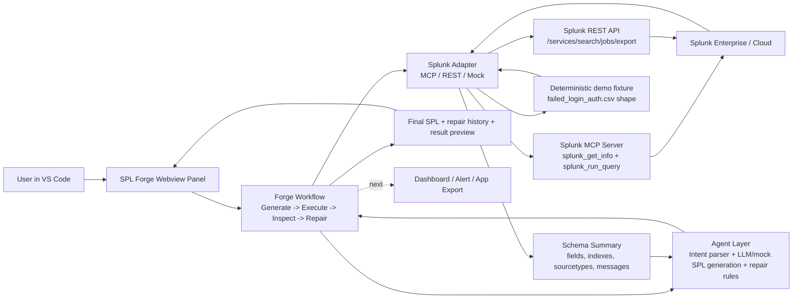

# SPL Forge Architecture Diagram

## Data Flow

1. User enters natural-language Splunk intent in VS Code.
2. Agent layer generates a candidate SPL query.
3. Splunk adapter executes through MCP, REST, or mock mode.
4. If execution fails or returns zero rows, schema inspection gathers fields, index, sourcetype, and messages.
5. Repair logic rewrites common index, sourcetype, field, login-action, and time-window problems.
6. Workflow reruns repaired SPL with capped attempts and renders final result in panel.

## AI And Splunk Integration

- AI layer: prompt intent parser, provider-backed SPL generation, deterministic mock fallback, and repair reasoning.
- Splunk layer: MCP-first query execution with REST fallback and mock mode for reliable demos.
- Safety posture: read-only search execution, bounded search limits, no destructive commands, human approval planned before export.
