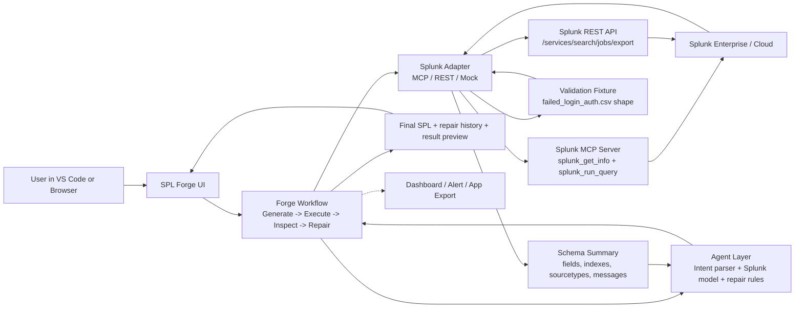

# SPL Forge Architecture

This document summarizes the current SPL Forge runtime architecture.

## System Goal

Turn natural-language Splunk intent into validated SPL and app-ready artifacts inside a developer workflow.

## Core Loop

```text
Intent -> Generate SPL -> Execute -> Inspect -> Repair -> Preview -> Export
```

## Workflow Diagram



## Primary Components

### VS Code Extension Layer

- Command entry through `SPL Forge: Open Panel`
- Prompt input and workflow controls
- Query plan, SPL, execution, repair, dashboard, and alert previews
- Export and publish actions

### Browser Dashboard

- Local browser interface served by `npm run dashboard`
- Uses the same workflow and Splunk execution paths as the extension
- Useful for quick product walkthroughs without launching Extension Development Host

### Agent Layer

- Intent parsing for artifact type, breakdowns, focus fields, time ranges, and thresholds
- Splunk-hosted-model generation through MCP AI Assistant tooling or a direct Splunk model endpoint
- Deterministic fallback generation for offline validation
- Repair reasoning driven by execution errors, empty results, and schema context

### Splunk Adapter Layer

- MCP mode through Splunk MCP Server tools
- REST mode through Splunk management API
- Mock mode for offline UI and test validation
- Shared result shape for fields, rows, messages, errors, and execution summaries

### Schema And Repair Layer

- Index, sourcetype, field, and metadata inspection
- Deterministic repair rules for common local data issues
- Time-window retry support for stale fixture timestamps
- Capped repair attempts with visible repair history

### Artifact Layer

- Dashboard Studio JSON preview
- Classic XML dashboard generation
- Disabled saved-search alert configuration
- App-ready folder export with app metadata and search-time extraction stanzas
- REST publish path for dashboard plus disabled alert

## Runtime Modes

### MCP Mode

Preferred product path for agent-friendly Splunk integration.

Used for:

- live SPL execution
- metadata discovery
- schema-aware repair
- result preview

### REST Mode

Direct Splunk management API fallback.

Used for:

- local Splunk Enterprise validation
- search execution through `/services/search/jobs/export`
- dashboard and saved-search publish operations

### Mock Mode

Offline path for UI review and CI-safe tests.

Mock mode is not a live Splunk validation path.

## Safety Posture

- Generated searches are bounded by configured row limits.
- Risky commands are stripped or blocked before execution.
- Generated alerts are disabled by default.
- Publish operations write dashboard and disabled alert artifacts only.
- Full app install automation and production-impacting actions remain out of current scope.

## Related Docs

- [`README.md`](../README.md)
- [`PRD.md`](../PRD.md)
- [`ROADMAP.md`](../ROADMAP.md)
- [`SPLUNK_SETUP.md`](./SPLUNK_SETUP.md)
- [`SPLUNK_MCP.md`](./SPLUNK_MCP.md)
- [`WALKTHROUGH_RUNBOOK.md`](./WALKTHROUGH_RUNBOOK.md)
