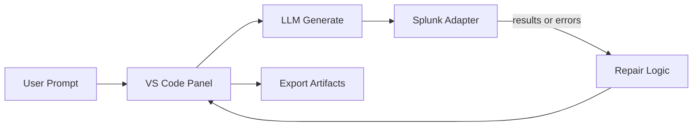

# SPL Forge Architecture

This document summarizes intended MVP architecture from product docs.

## System Goal

Turn natural-language intent into validated Splunk artifacts inside development workflow.

## Core Loop

```text
User intent -> LLM generation -> Splunk execution -> Error/result inspection -> Repair -> Preview -> Export
```

## Day 1 Diagram Draft



## Primary Components

### 1. VS Code Extension Layer

Responsible for:

- command entry
- prompt UI
- progress display
- result preview
- export actions

### 2. Agent Layer

Responsible for:

- prompt construction
- SPL generation
- repair prompts
- explanation generation
- artifact drafting

### 3. Splunk Adapter Layer

Responsible for:

- query execution
- field and schema inspection
- environment capability detection
- MCP, REST, or mock mode switching

### 4. Artifact Layer

Responsible for:

- dashboard config generation
- alert config generation
- saved search packaging
- app-ready export preparation

## Recommended MVP Flow

1. User enters prompt in panel.
2. Agent generates candidate SPL.
3. Adapter runs SPL in Splunk.
4. If error or empty-result issue, system collects diagnostics.
5. Agent repairs SPL using diagnostics and metadata.
6. Final query preview shown to user.
7. User approves export action.

## Design Principles

- Human approval before risky action
- Real execution before trust claim
- Environment-aware repair, not generic guessing
- Mock-safe demo fallback
- Narrow MVP, polished flow

## Suggested Module Layout

```text
src/
├─ extension.ts
├─ config/
│  └─ env.ts
├─ agent/
│  ├─ generate.ts
│  ├─ repair.ts
│  └─ explain.ts
├─ splunk/
│  ├─ mcp.ts
│  ├─ rest.ts
│  ├─ mock.ts
│  └─ schema.ts
├─ artifacts/
│  ├─ dashboard.ts
│  ├─ alert.ts
│  └─ package.ts
└─ panels/
   └─ assistant.ts
```

## Current Day 1 Scaffold

```text
src/
├─ extension.ts
├─ panels/
│  └─ assistant.ts
└─ test/
   └─ extension.test.ts
```

## Runtime Modes

### MCP Mode

Best long-term path. Strong alignment with agentic workflow.

### REST Fallback

Practical fallback when MCP unavailable.

### Mock Mode

Required for resilient demos and local iteration.

## What Success Looks Like

- Query generated from plain English
- At least one failure mode detected and repaired
- Final result preview understandable
- Export artifact believable and reusable

## Related Docs

- [`PRD.md`](./PRD.md)
- [`ROADMAP.md`](./ROADMAP.md)
- [`DEMO_RUNBOOK.md`](./DEMO_RUNBOOK.md)
