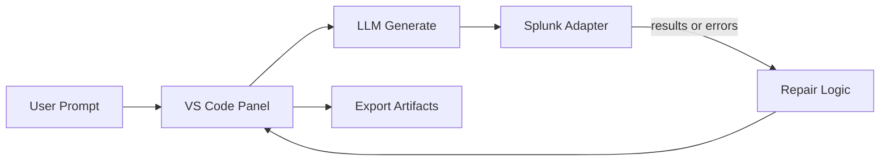

# SPL Forge Architecture

This document summarizes intended MVP architecture from product docs.

## System Goal

Turn natural-language intent into validated Splunk artifacts inside development workflow.

## Core Loop

```text
User intent -> LLM generation -> Splunk execution -> Error/result inspection -> Repair -> Preview -> Export
```

## Day 1 Diagram Draft



## Primary Components

### 1. VS Code Extension Layer

Responsible for:

- command entry
- prompt UI
- progress display
- result preview
- export actions

### 2. Agent Layer

Responsible for:

- prompt construction
- SPL generation
- repair prompts
- explanation generation
- artifact drafting

### 3. Splunk Adapter Layer

Responsible for:

- query execution
- field and schema inspection
- environment capability detection
- MCP or REST mode switching

### 4. Artifact Layer

Responsible for:

- dashboard config generation
- alert config generation
- saved search packaging
- app-ready export preparation

## Recommended MVP Flow

1. User enters prompt in panel.
2. Agent generates candidate SPL.
3. Adapter runs SPL in Splunk.
4. If error or empty-result issue, system collects diagnostics.
5. Agent repairs SPL using diagnostics and metadata.
6. Final query preview shown to user.
7. User approves export action.

## Design Principles

- Human approval before risky action
- Real execution before trust claim
- Environment-aware repair, not generic guessing
- Mock-safe demo fallback
- Narrow MVP, polished flow

## Suggested Module Layout

```text
src/
├─ extension.ts
├─ config/
│  └─ env.ts
├─ agent/
│  ├─ generate.ts
│  ├─ repair.ts
│  └─ explain.ts
├─ splunk/
│  ├─ mcp.ts
│  ├─ rest.ts
│  ├─ mock.ts
│  └─ schema.ts
├─ artifacts/
│  ├─ dashboard.ts
│  ├─ alert.ts
│  └─ package.ts
└─ panels/
   └─ assistant.ts
```

## Current Day 1 Scaffold

```text
src/
├─ extension.ts
├─ panels/
│  └─ assistant.ts
└─ test/
   └─ extension.test.ts
```

## Current Day 2 Scaffold

```text
src/
├─ extension.ts
├─ agent/
│  └─ generate.ts
├─ config/
│  └─ env.ts
├─ panels/
│  └─ assistant.ts
└─ test/
   └─ extension.test.ts
```

Day 2 currently supports:

- prompt entry inside webview panel
- webview message passing into extension runtime
- `.env.local`-aware config loading
- Splunk MCP AI Assistant tool calls or direct Splunk-hosted model endpoint calls
- raw provider output and parsed SPL rendering in panel
- raw provider output and parsed SPL rendering in panel
- output channel logging for prompt/provider/result

## Current Day 3 Scaffold

```text
src/
├─ agent/
│  └─ generate.ts
├─ panels/
│  └─ assistant.ts
└─ test/
   └─ extension.test.ts
```

Day 3 currently supports:

- intent parsing for artifact type, breakdowns, focus field, time range, and thresholds
- schema-aware LLM prompts for the failed-login demo dataset
- deterministic mock SPL generation for dashboard, alert, and trend prompts
- query plan rendering in the panel

## Current Day 4 Scaffold

```text
src/
├─ config/
│  └─ env.ts
├─ splunk/
│  └─ execute.ts
├─ extension.ts
├─ panels/
│  └─ assistant.ts
└─ test/
   └─ extension.test.ts
```

Day 4 currently supports:

- `mock` execution mode using deterministic failed-login fixture rows
- `rest` execution mode using Splunk `/services/search/jobs/export`
- `mcp` execution mode using Splunk MCP Server `splunk_run_query`
- MCP preflight call through `splunk_get_info`
- execution summaries, messages, fields, and result previews in the panel
- runtime config for Splunk MCP endpoint/token, REST URL/credentials, search limit, and self-signed TLS
- error reporting when REST credentials are missing or Splunk returns an error
- local self-hosted trial auth-query rewrite for CSV fixture field extraction and stale-timestamp retry

## Current Day 5 Scaffold

```text
src/
├─ agent/
│  ├─ generate.ts
│  ├─ repair.ts
│  └─ workflow.ts
├─ splunk/
│  ├─ execute.ts
│  └─ schema.ts
├─ extension.ts
├─ panels/
│  └─ assistant.ts
└─ test/
   └─ extension.test.ts
```

Day 5 currently supports:

- forge workflow orchestration around generate -> execute -> inspect -> repair -> rerun
- schema inspection summary for fields, indexes, sourcetypes, and probe messages
- deterministic repair rules for common wrong index, sourcetype, field alias, action value, and time-window failures
- capped repair attempts before returning final execution state
- repair history rendering in the VS Code panel and output channel
- independent unit coverage for repair behavior and workflow success path

## Current Day 6 Scaffold

```text
src/
├─ artifacts/
│  └─ dashboard.ts
├─ agent/
│  └─ workflow.ts
├─ panels/
│  └─ assistant.ts
└─ test/
   └─ extension.test.ts
```

Day 6 currently supports:

- deterministic Dashboard Studio JSON generation from final working SPL
- classic Splunk dashboard XML generation for Splunk UI loading
- visualization selection from prompt intent and result schema (`bar`, `line`, `singlevalue`, or `table`)
- panel preview for dashboard title, visualization type, fields, and JSON
- REST publisher CLI for loading generated dashboard into Splunk UI
- deterministic saved-search alert draft generation from threshold prompts
- panel preview for alert title, condition, schedule, and savedsearches.conf draft
- local Splunk app folder export with `app.conf`, dashboard XML, `savedsearches.conf`, metadata, README, and manifest
- output-channel logging for generated dashboard artifacts
- unit coverage for dashboard and alert artifact generation plus workflow integration

## Runtime Modes

### MCP Mode

Best hackathon path. Strong alignment with agentic workflow. Day 4 implementation calls MCP `splunk_get_info` plus `splunk_run_query`, normalizes tool output into panel result preview, and rewrites local CSV demo auth queries into working extraction pipelines when sample data lacks search-time field extraction.

### REST Fallback

Practical fallback when MCP unavailable. Day 4 implementation posts generated SPL to Splunk search export endpoint.

### Mock Mode

Required for resilient demos and local iteration. Day 4 implementation returns deterministic rows from the failed-login fixture shape.

## What Success Looks Like

- Query generated from plain English
- At least one failure mode detected and repaired
- Final result preview understandable
- Export artifact believable and reusable

## Related Docs

- [`PRD.md`](../PRD.md)
- [`ROADMAP.md`](../ROADMAP.md)
- [`DEMO_RUNBOOK.md`](./DEMO_RUNBOOK.md)
